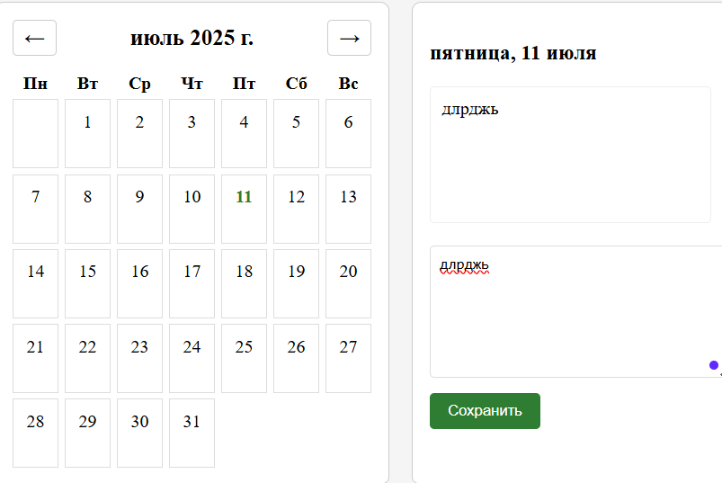

# Отчет по Индивидуальной работе

### Цель

Разработка календаря с возможностью добавления кратких текстовых заметок по дням,
с хранением данных на клиенте.

### Основной функционал

- Просмотр календаря на текущий месяц.
- Переключение между месяцами.
- Добавление и редактирование заметок.
- Подсветка дней с заметками.
- Сохранение данных в `localStorage`.

## Структура проекта и ключевые модули
В проекте не используются массивы для хранения данных.
Вместо этого заметки хранятся в localStorage как отдельные ключи.
В notesStorage.js создаются функции для получения и обработки этих данных,
но они не собираются в массив.

### Структура программы
### `index.html`

Главная HTML-страница. Включает:
- Блок с календарем.
- Кнопки переключения месяцев.
- Модальное окно или форму редактирования заметки.

### `style.css`, `src/calendar.css`

Оформление интерфейса:
- Текущий день.
- Дни с заметками.
- Навигационные элементы.

### `src/calendar.js`

- Генерация таблицы дней месяца.
- Поддержка перехода по месяцам.
- Отметка дней с заметками.
```js
export function renderCalendar(currentDate) {
 
}
```

### `src/notesStorage.js`

- Сохраняет и извлекает заметки в/из `localStorage`.
- Использует формат ключей `YYYY-MM-DD`.

```js
export function saveNote(date, note) {
  localStorage.setItem(date, note);
}
```

### `src/notesUI.js`

- Отображение модального окна заметки.
- Передача данных в `notesStorage`.

### Добавление заметки

1. Кликаем по дате
2. Вводим текст


###  Переключение месяцев

```js
document.getElementById("prevMonth").addEventListener("click", () => {
  currentMonth--; 
  renderCalendar();
});
```
### Описание функций
#### **`loadNotes`**
Функция загружает существующие заметки из локального хранилища 
браузера. Она достаёт данные из `localStorage` с ключом 
`calendarNotes`, синхронизирует с локальным объектом `notes`.
Это нужно для того, чтобы при перезагрузке страницы все ранее сохранённые заметки отображались в календаре.
``` javascript
export function loadNotes() {
    const savedNotes = localStorage.getItem('calendarNotes');
    if (savedNotes) {
        Object.assign(notes, JSON.parse(savedNotes));
    }
}
```
#### **`saveNote`**
Сохраняет новую заметку или удаляет старую. Если переданный 
текст пустой (или пробелы), заметка для этой даты удаляется.
В противном случае заметка сохраняется. Все изменения 
синхронизируются с локальным хранилищем, чтобы данные
сохранялись между сеансами.
``` javascript
export function saveNote(date, text) {
    if (text.trim()) {
        notes[date] = text;
    } else {
        delete notes[date];
    }
    localStorage.setItem('calendarNotes', JSON.stringify(notes));
}
```
#### **`getNote`**
Возвращает текст записи для указанной даты. Используется
для получения сохранённой заметки для конкретного дня календаря.
``` javascript
export function getNote(date) {
    return notes[date];
}
```
#### **`renderCalendar`**
Эта функция отвечает за отрисовку интерфейса календаря. 
Она удаляет предыдущие элементы календаря, создаёт новый список 
дней для текущего месяца и отображает их. Функция также выводит
заголовок с месяцем и годом.
``` javascript
export function renderCalendar(date) {
    const year = date.getFullYear();
    const month = date.getMonth();

    const firstDay = new Date(year, month, 1);
    const lastDay = new Date(year, month + 1, 0);
    const startDay = (firstDay.getDay() + 6) % 7;

    const daysGrid = document.getElementById('daysGrid');
    daysGrid.innerHTML = '';

    document.getElementById('currentMonth').textContent =
        date.toLocaleString('ru-RU', { month: 'long', year: 'numeric' });

    for (let i = 0; i < startDay; i++) {
        daysGrid.appendChild(document.createElement('div'));
    }

    for (let day = 1; day <= lastDay.getDate(); day++) {
        const dayElement = document.createElement('div');
        dayElement.textContent = day;
        dayElement.dataset.date = `${year}-${month+1}-${day}`;
        daysGrid.appendChild(dayElement);
    }
}
```
#### **`setupNoteModal`**
Настраивает работу модального окна для добавления и
редактирования заметок. Обработка кликов на дни календаря 
открывает модальное окно, где пользователь может сохранить или
изменить заметку для выбранной даты. Также добавлена возможность
закрывать окно через кнопку `close`.
``` javascript
export function setupNoteModal() {
    const modal = document.getElementById('noteModal');

    document.getElementById('daysGrid').addEventListener('click', (e) => {
        if (e.target.tagName === 'DIV' && e.target.textContent) {
            const date = e.target.dataset.date;
            document.getElementById('noteDate').textContent = date;
            document.getElementById('noteText').value = getNote(date) || '';
            modal.style.display = 'block';
        }
    });

    document.getElementById('saveNote').addEventListener('click', () => {
        const date = document.getElementById('noteDate').textContent;
        const text = document.getElementById('noteText').value;
        saveNote(date, text);
        modal.style.display = 'none';
    });

    document.querySelector('.close').addEventListener('click', () => {
        modal.style.display = 'none';
    });
}
```
#### **`prevMonth`, `nextMonth`**
Функции позволяют перемещаться между предыдущим и 
следующим месяцами в календаре. Они изменяют текущий месяц 
с помощью объекта `Date`, а затем вызывают перерисовку
календаря через `renderCalendar`.
``` javascript
document.getElementById('prevMonth').addEventListener('click', () => {
    currentDate.setMonth(currentDate.getMonth() - 1);
    renderCalendar();
});

document.getElementById('nextMonth').addEventListener('click', () => {
    currentDate.setMonth(currentDate.getMonth() + 1);
    renderCalendar();
});
```


## Вывод
Данный проект представляет собой полнофункциональное веб-приложение — интерактивный календарь
с возможностью добавления, редактирования и хранения текстовых заметок по датам.
Основная задача решена с помощью JavaScript, без привлечения сторонних библиотек.
Архитектура проекта модульная и разделена на несколько ключевых частей: модуль, ответственный
за генерацию и отображение календаря (`calendar.js`), модуль управления данными заметок
с использованием `localStorage` (`notesStorage.js`), и пользовательский интерфейс для работы
с заметками (`notesUI.js`). Главная точка входа (`index.js`) занимается инициализацией и управлением
навигацией между месяцами.
## Источники
- https://github.com/MSU-Courses/javascript
- https://www.w3schools.com/html/html_examples.asp
- https://developer.mozilla.org/ru/docs/Learn_web_development/Getting_started/Your_first_website/Adding_interactivity
- https://www.youtube.com/@BroCodez