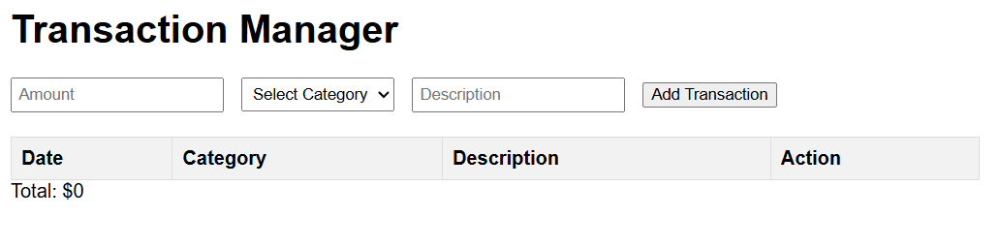
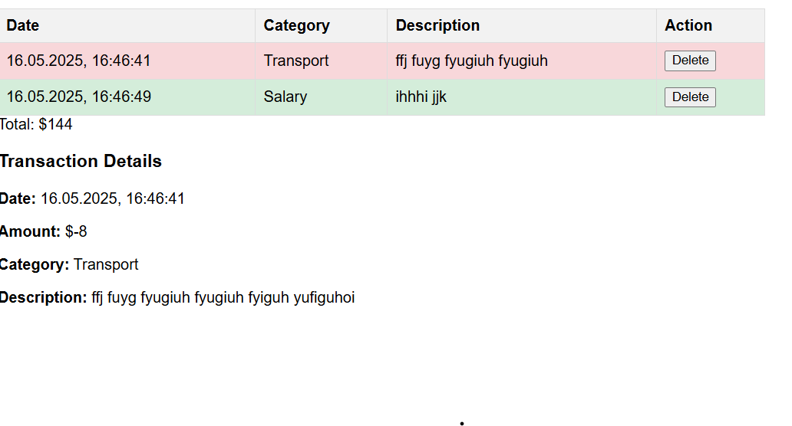
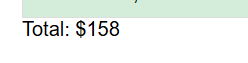

# Лабораторная работа №4. Работа с DOM-деревом и событиями в JavaScript

Вариант 1

## Цель работы

Ознакомить студентов с основами взаимодействия JS с DOM-деревом 
на основе веб-приложения для **учета личных финансов**.

## Условия

### Шаг 1. Настройка и структурирование проекта
 **Структура проекта**

- index.html: основная страница с формой и таблицей.
- style.css: стили для таблицы и формы.
- src/index.js: точка входа, обработка формы.
- src/transactions.js: управление массивом транзакций.
- src/ui.js: отрисовка таблицы и деталей.
- src/utils.js: вспомогательные функции.

### Шаг 2. Представление транзакции

1. Создан массив `transactions`, который содержит объекты транзакций.
2. Каждый объект транзакции имеет следующие поля:
    1. `id`: уникальный идентификатор транзакции.
    2. `date`: дата и время добавления транзакции.
    3. `amount`: сумма транзакции.
    4. `category`: категория транзакции.
    5. `description`: описание транзакции.
```
export let transactions = []; 

export function addTransaction(transaction) {
    transactions.push(transaction); // добавление новой транзакции
}
export function removeTransaction(id) {
    transactions = transactions.filter(transaction => transaction.id !== id); // удаление по ID
}
export function getTotal() {
    return transactions.reduce((total, transaction) => total + transaction.amount, 0); // сумма
}
```

### Шаг 3. Отображение транзакций

1. Создана пустая HTML-таблица, для добавления транзакций.
2. Таблица содержит следующие столбцы:
    - Дата и Время
    - Категория транзакции
    - Краткое описание транзакции
    - Действие (кнопка удаления транзакции)

### Шаг 4. Добавление транзакций

1. Создана функция `addTransaction()`,
```
function addTransaction(event) {
    event.preventDefault();
    const amount = parseFloat(document.getElementById('amount').value);
    const category = document.getElementById('category').value;
    const description = document.getElementById('description').value;

    const transaction = {
        id: generateId(),
        date: new Date(),
        amount,
        category,
        description
    };
    addToTransactions(transaction);
    renderTransaction(transaction);
    form.reset();
}
```
2. В функции `addTransaction()`:
    - Создан объект транзакции с данными из формы.
    - Добавлен созданный объект в массив `transactions`.
    - Создается новая строка таблицы с данными из объекта транзакции
   и добавляется её в таблицу.
        - Если транзакция совершена на положительную сумму, то строка таблицы отмечается **зеленым цветом**, иначе **красным**.
        - В колонке `description` отображается краткое описание транзакции (первые 4 слова).

### Шаг 5. Управление транзакциями

1. В каждой строке таблицы добавлена кнопку удаления.
```
export function renderTransaction(transaction) {
    const row = document.createElement('tr');
    row.innerHTML = `
        <td>${formatDate(transaction.date)}</td>
        <td>${transaction.category}</td>
        <td>${shortenDescription(transaction.description)}</td>
        <td><button class="delete-btn">Delete</button></td> 
    `;
    tableBody.appendChild(row);
}
```
2. При клике на кнопку удаления получаем идентификатор транзакции и удаляем все из массива.
```
export function removeTransaction(id) {
    transactions = transactions.filter(transaction => transaction.id !== id); 
}
```
3. Обработчик событий на `клик` на кнопку определен для элемента `<table>`
```
export function setupTableEvents() {
    document.querySelector('#transactionsTable').addEventListener('click', (e) => {
        if (e.target.classList.contains('delete-btn')) { 
            const row = e.target.closest('tr'); 
            const id = row.dataset.id; 
            removeTransaction(id);  
            row.remove();  
            updateTotal();  
        }
    });
}
```

### Шаг 6. Подсчет суммы транзакции

1. Написана функция `getTotal()`, которая вызывается после добавления или удаления транзакции.
```
export function getTotal() {
    return transactions.reduce((total, transaction) => total + transaction.amount, 0);
}
```
2. Отображается общая сумма на странице.

### Шаг 7. Отображение полное транзакции

1. В файле `index.html` создан блок для отображения описания транзакции.
```
<div id="transactionDetails"></div>
```
2. При нажатии на строку с транзакцией в таблице, отображается полное описание в элементе `<div>` или `<p>` ниже таблицы.

### Шаг 8. Добавление транзакции

1. Добавлена форма на страницу для добавления транзакции в таблицу (для категории использован`select`).
```
<form id="transactionForm">
    <input type="number" id="amount" placeholder="Amount" required>
    <select id="category" required>  
        <option value="">Select Category</option>
        <option value="Food">Food</option>
        <option value="Transport">Transport</option>
        <option value="Salary">Salary</option>
        <option value="Other">Other</option>
    </select>
    <input type="text" id="description" placeholder="Description" required>
    <button type="submit">Add Transaction</button>
</form>
```

## Контрольные вопросы

1. Каким образом можно получить доступ к элементу на веб-странице с помощью JavaScript?
```
Для доступа к элементу на веб-странице можно использовать несколько методов DOM API:
1. - **`getElementById`**:
2. - **`querySelector`**:
3. - **`querySelectorAll`**:
4. - **`getElementsByClassName`**:
5. - **`getElementsByTagName`**:

```
2. Что такое делегирование событий и как оно используется для эффективного управления событиями на элементах DOM?
```
Делегирование событий — это подход, при котором обработчик
 события добавляется не на конкретные элементы, а на их 
 общего родительского элемента. При этом событие "всплывает"
 от вложенного элемента к родителю, и обработчик перехватывает 
 событие на более высоком уровне

```
3. Как можно изменить содержимое элемента DOM с помощью JavaScript после его выборки?
```
Содержимое элемента DOM можно изменить с помощью 
свойства **`innerHTML`**, **`textContent`** 

```
4. Как можно добавить новый элемент в DOM дерево с помощью JavaScript?
```
Для добавления нового элемента в DOM можно использовать комбинацию методов создания и вставки узлов.

```