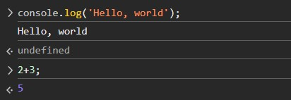
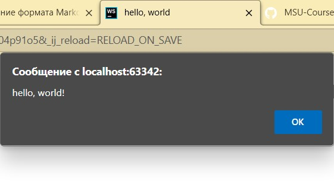
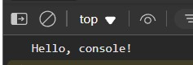
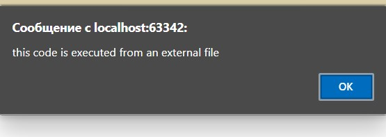
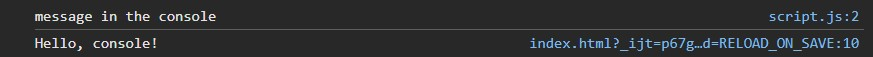
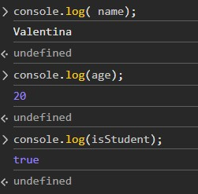
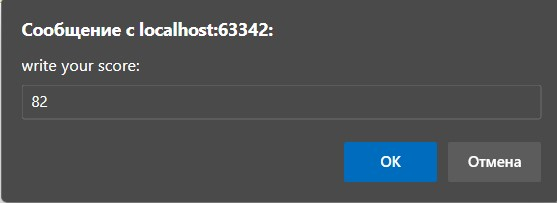
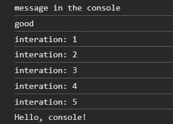

## Лабораторная Работа №1

### 1. Инструкция по запуску проекта
1. Установка необходимых программ для выполнения работы.
2. Создание html и js файлов, нужных для выполнения работы.

### 2. Описание лабораторной работы
Познакомиться с основами JavaScript, научиться писать и
выполнять код в браузере и в локальной среде, 
разобраться с базовыми конструкциями языка.

### 3. Краткая документация проекта + фотоотчет

#### 1. Задание 1. Выполнение кода в браузере
- работа с консолью
  
Выводит несколько выражений.
-   создание следующего html кода и выполнение его работы
```html
   <!DOCTYPE html>
<html lang="en">
<head>
    <title>hello, world</title>
</head>
<body>
<script>
    alert("hello, world!");
    console.log("Hello, console!");
</script>
</body>
</html>
   ```
Код выводит следующее всплывающие сообщение:

Также, при работе открытии консоли всплывает следующий текст:


- подключение внешнего js файла со следующим кодом и внедрение его в html файл
``` 
alert("this code is executed from an external file ");
console.log("message in the console");
``` 
Так как мы подключили js файл в head, то его команды будут в приоритете

Т.е, сначала выполняются инструкции, написанные в js, а после те, что в html

При открытии консоли всплывает следующее сообщение:


#### Задание 2. Работа с типами данных
- Объявляем следующий код в файле, который вывод следующее в консоли:
  ``` let name = "Valentina";
  let age = 20;
  let isStudent = true; 
  ```
  
- вставляем следующий код в js:
```javascript
let score = prompt("write your score:");
if (score >= 90) {
    console.log("great!");
} else if (score >= 70) {
    console.log("good");
} else {
    console.log("can be better!");
}

for (let i = 1; i <= 5; i++) {
    console.log(`iteration: ${i}`);
}
```
После вставки кода всплывает следующее окно, которое просит ввести данные балла

После ввода этих данных, в консоли выдается оценка и выполняется цикл for


### 4. Ответы на контрольные вопросы
1. Чем отличается `var` от `let` и `const`? 
```
Var от let отличаются областью видимости. 
Let ограничен конкретным блоком,
а значения var будут присвоены от начала до конца кода.
Также var устаревшая форма кода, а let новейшая форма кода.
А также, var можно переобъявлять бесконечно, а let 
единожды в 1 области видимости.
Const схожа с let, но у нее есть ряд особенностей,
например как:
1. Она должна быть инициализирована при объявлении кода.
2. Значения const, нельзя изменить после ее инициализировании.
 ```
2. Что такое неявное преобразование типов в JavaScript?
```
это процесс, при котором JS автоматически 
преобразует один тип данных в другой во время 
выполнения программы, чтобы соответствовать контексту
операции
Например: сложение строки и числа. 
JS в данном случае приведет
тип числа в строку, и выведет результат в виде
сложения двух строк.
 ```
3. Как работает оператор `==` в сравнении с `===`?
```
Первый оператор выполняет неявное преобразование типов,
а второй сравнивает и проверяет тип данных
```
### 5. Источники
- [лекции](https://github.com/MSU-Courses/javascript_typescript/tree/main)


