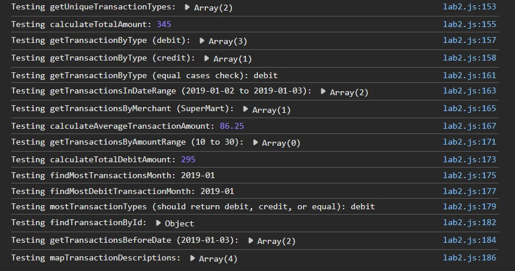

# Лабораторная работа №2. Основы работы с массивами, функциями и объектами в JavaScript
## Цель работы 
Изучить основы работы с массивами и функциями в JavaScript, применяя их для обработки и анализа транзакций.
## Условие
### Шаг 1. Создание массива транзакций
1. Создание файла lab2.js для размещения кода.
2. Создание массива объектов с транзакциями. 
Каждая транзакция содержит следующие свойства:
transaction_id - уникальный идентификатор транзакции.
transaction_date - дата транзакции.
transaction_amount - сумма транзакции.
transaction_type - тип транзакции (приход или расход).
transaction_description - описание транзакции.
merchant_name - название магазина или сервиса.
card_type - тип карты (кредитная или дебетовая).
```
const transactions = [

        {
            transaction_id: "1",
            transaction_date: "2019-01-01",
            transaction_amount: 100.0,
            transaction_type: "debit",
            transaction_description: "Payment for groceries",
            merchant_name: "SuperMart",
            card_type: "Visa",
        },
        {
            transaction_id: "2",
            transaction_date: "2019-01-02",
            transaction_amount: 50.0,
            transaction_type: "credit",
            transaction_description: "Refund for returned item",
            merchant_name: "OnlineShop",
            card_type: "MasterCard",
        },
        {
            transaction_id: "3",
            transaction_date: "2019-01-03",
            transaction_amount: 75.0,
            transaction_type: "debit",
            transaction_description: "Dinner with friends",
            merchant_name: "RestaurantABC",
            card_type: "Amex",
        },
        {
            transaction_id: "4",
            transaction_date: "2019-01-04",
            transaction_amount: 120.0,
            transaction_type: "debit",
            transaction_description: "Shopping at Mall",
            merchant_name: "FashionStoreXYZ",
            card_type: "Discover",
        },
    ];
```

### Шаг 2. Реализация функций для анализа транзакций
1. #### getUniqueTransactionTypes(transactions)
```
const getUniqueTransactionTypes = (transactions) => {
    return [...new Set(transactions.map(t => t.transaction_type))];
};
```
2. #### calculateTotalAmount(transactions) 
```
const calculateTotalAmount = (transactions) => {
    return transactions.reduce((sum, t) => sum + t.transaction_amount, 0);
};
```
3. #### getTransactionByType(transactions, type)
```
const getTransactionByType = (transactions, type) => {
    return transactions.filter(t => t.transaction_type === type);
};
```
4. #### getTransactionsInDateRange(transactions, startDate, endDate)
```
const getTransactionsInDateRange = (transactions, startDate, endDate) => {
    return transactions.filter(t => {
        if (t.transaction_date < startDate) {
            return false;
        }
        else if (t.transaction_date > endDate) {
            return false;
        }
        return true;
    });
};
```
5. #### getTransactionsByMerchant(transactions, merchantName)
```
const getTransactionsByMerchant = (transactions, merchantName) => {
    return transactions.filter(t => t.merchant_name === merchantName);
};
```
6. #### calculateAverageTransactionAmount(transactions)
``` 
const calculateAverageTransactionAmount = (transactions) => {
    if (transactions.length === 0) {
        return 0;
    }
    else {
        return calculateTotalAmount(transactions) / transactions.length;
    }
};
```
7. #### getTransactionsByAmountRange(transactions, minAmount, maxAmount)
```
const getTransactionsByAmountRange = (transactions, minAmount, maxAmount) => {
    return transactions.filter(t => {
        if (t.transaction_amount >= minAmount) {
            return t.transaction_amount <= maxAmount;
        }
        return false;
    });
};
```
8. ####  calculateTotalDebitAmount(transactions)
```
const calculateTotalDebitAmount = (transactions) => {
    return calculateTotalAmount(getTransactionByType(transactions, "debit"));
};
```
9. #### findMostTransactionsMonth(transactions)
```
const findMostTransactionsMonth = (transactions) => {
    const countByMonth = {};
    transactions.forEach(t => {
        const month = t.transaction_date.slice(0, 7);
        if (countByMonth[month]) {
            countByMonth[month] += 1;
        } else {
            countByMonth[month] = 1;
        }
    });
      let mostTransactionsMonth = Object.keys(countByMonth)[0];

    Object.keys(countByMonth).forEach(month => {
        if (countByMonth[month] > countByMonth[mostTransactionsMonth]) {
            mostTransactionsMonth = month;
        }
    });

    return mostTransactionsMonth;
};
```
10. #### findMostDebitTransactionMonth(transactions)
```
const findMostDebitTransactionMonth = (transactions) => {
    return findMostTransactionsMonth(getTransactionByType(transactions, "debit"));
};
```
11. #### mostTransactionTypes(transactions)
```
const mostTransactionTypes = (transactions) => {
    const debitCount = getTransactionByType(transactions, "debit").length;
    const creditCount = getTransactionByType(transactions, "credit").length;

    if (debitCount > creditCount) {
        return "debit";
    } else if (creditCount > debitCount) {
        return "credit";
    } else {
        return "equal";
    }
};
```
12. #### getTransactionsBeforeDate(transactions, date)
```
const getTransactionsBeforeDate = (transactions, date) => {
    return transactions.filter(t => t.transaction_date < date);
};
```
13. #### findTransactionById(transactions, id)
```
const findTransactionById = (transactions, id) => {
    const transaction = transactions.find(t => t.transaction_id === id);
    if (transaction) {
        return transaction;
    } else {
        return null;
    }
};
```
14. #### mapTransactionDescriptions(transactions)
```
const mapTransactionDescriptions = (transactions) => {
    return transactions.map(t => t.transaction_description);
};
```
### Шаг 3. Тестирование функций


### Контрольные вопросы
1. Какие методы массивов можно использовать для обработки объектов в JavaScript?

Для обработки массивов объектов в JavaScript можно использовать
map() для преобразования каждого элемента, filter() для выборки элементов по условию и reduce() для вычисления итогового значения (например, суммы). Методы find() находят первый элемент, соответствующий условию, а forEach() 
позволяет выполнить действие для каждого элемента массива.
2. Как сравнивать даты в строковом формате в JavaScript?

В JavaScript, чтобы сравнить строки с датами,
их можно преобразовать в объекты Date с помощью конструктора
new Date(). Затем для сравнения дат можно использовать
операторы <, >, <=, >= или метод getTime(),
который возвращает числовое представление времени.
3. В чем разница между map(), filter() и reduce() при работе с массивами объектов?
* Метод reduce() применяет функцию к каждому элементу массива,
двигаясь слева направо, и возвращает одно результирующее значение.
* Метод filter() создает новый массив, содержащий все элементы, 
которые прошли проверку, заданную в переданной функции
* Метод map() создаёт новый массив, содержащий результат вызова 
указанной функции для каждого элемента исходного массива.